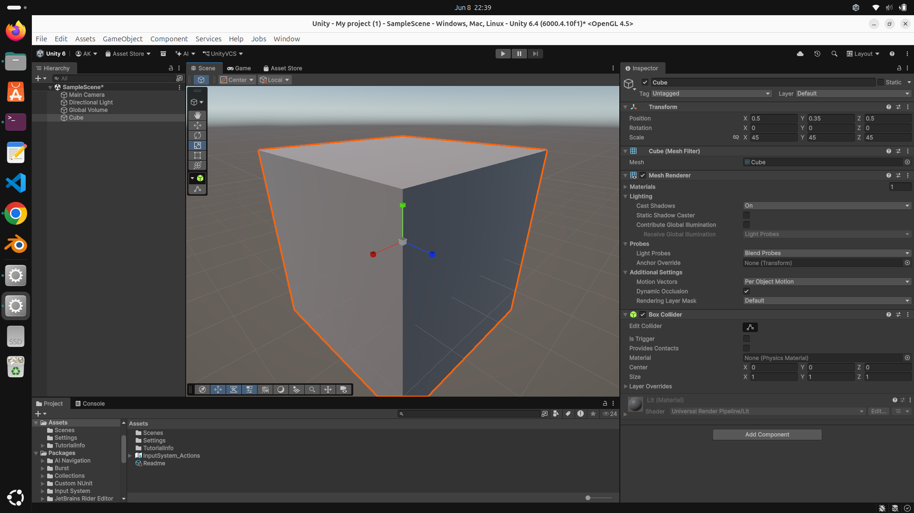

# Unity First Steps

A basic introduction project to get familiar with the Unity game engine environment.

---

## 🛠️ Project Details

* **Project Name:** `Unity_first`
* **Unity Version Used:** `Unity 6.4 (6000.4.10f1)`
* **Platform:** Linux

---

## 👁️ First Impressions

Coming into Unity, the initial interface experience has been positive:
* **The Environment:** It felt intuitive and well-structured right out of the box. 
* **Learning Outlook:** Exploring the component system and navigating the various windows (Scene, Game, Hierarchy, Inspector) feels like it will be incredibly interesting and engaging as the project develops.

